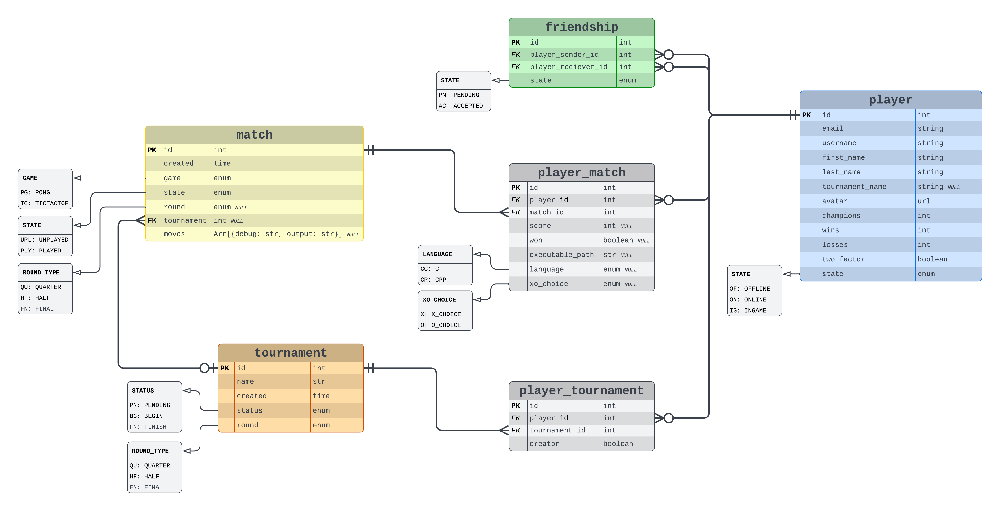
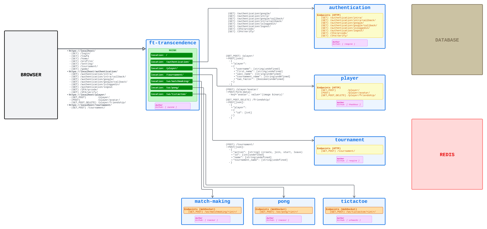
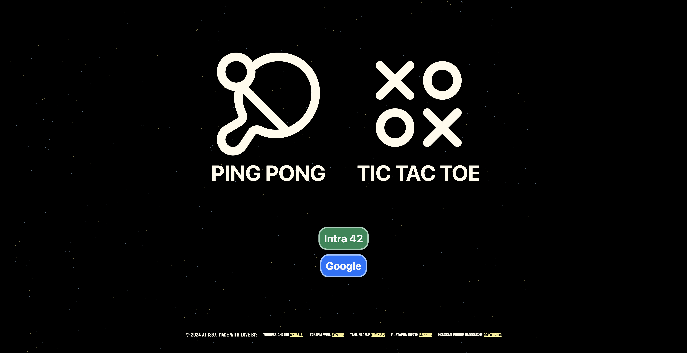
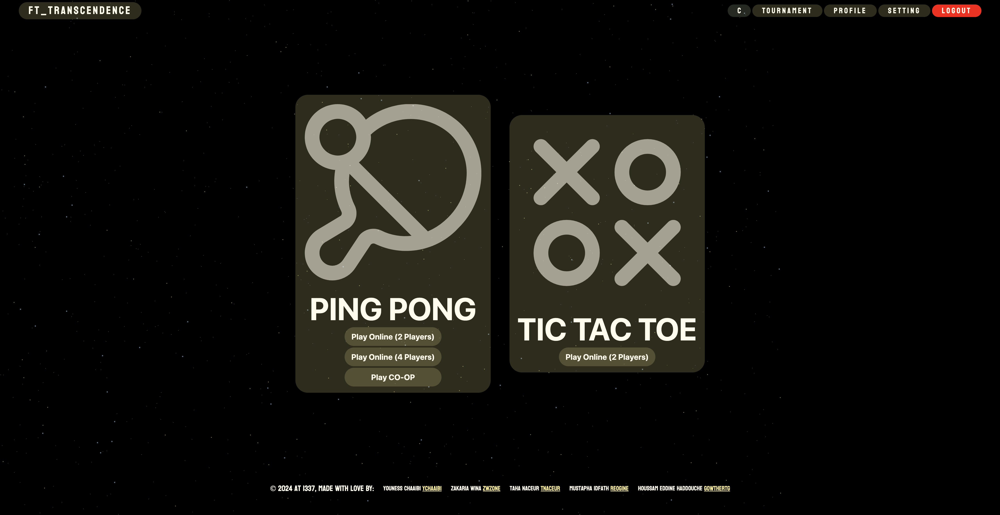
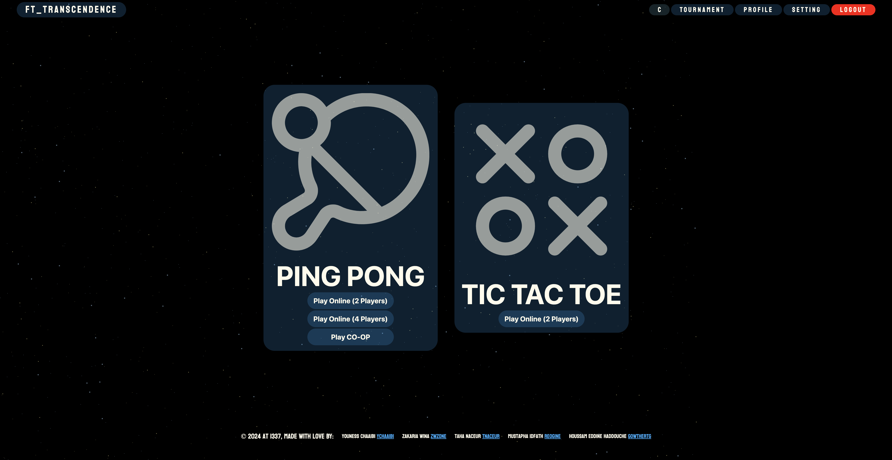
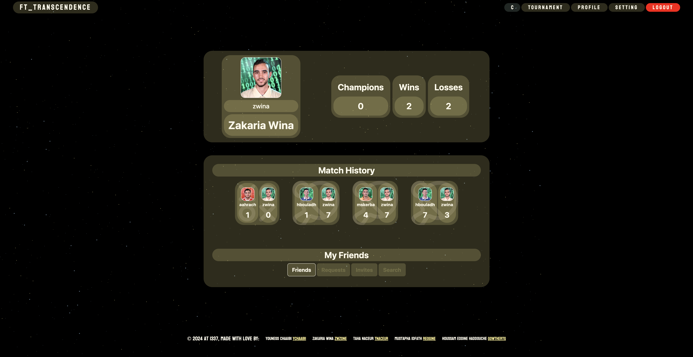
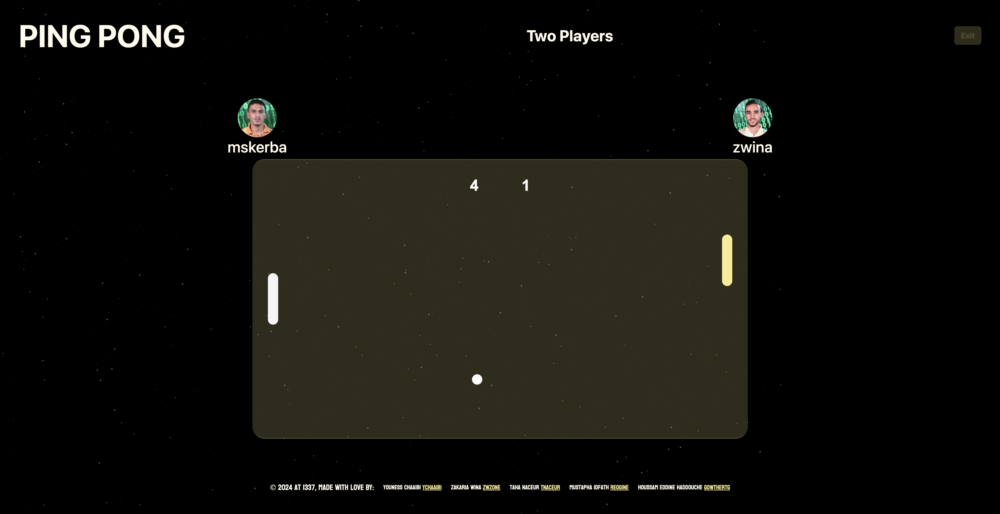
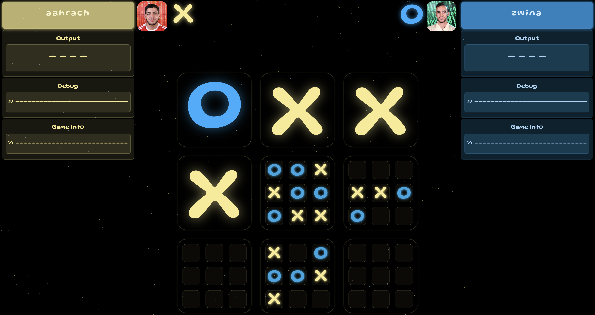

# ft_transcendence

"ft_transcendence" is a project built with a microservice architecture that uses Django and WebSockets for the back end, and PostgreSQL for data storage and deployed with Docker. The front end is built with HTML/CSS/Javascript using Bootstrap, and The games are implemented in JavaScript using the Canvas API. The project also includes various libraries and frameworks, including Django Channels for WebSockets, Django REST framework for API development, and Django ORM for database management. The project implements user authentication and authorization for security purposes. The project leverages front-end and back-end technologies to provide a seamless and enjoyable gaming experience.

# Diagrams

### Entity Relationship Diagram

### Services Architecture

# ScreenShots

